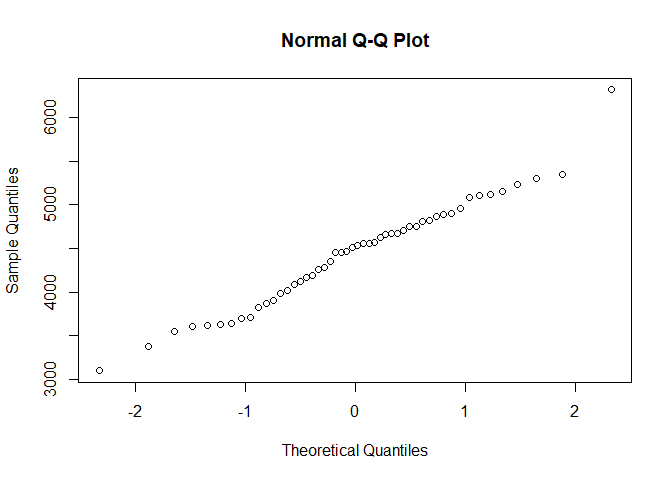
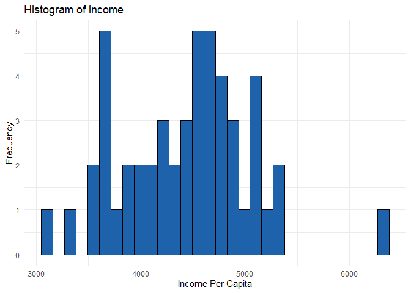
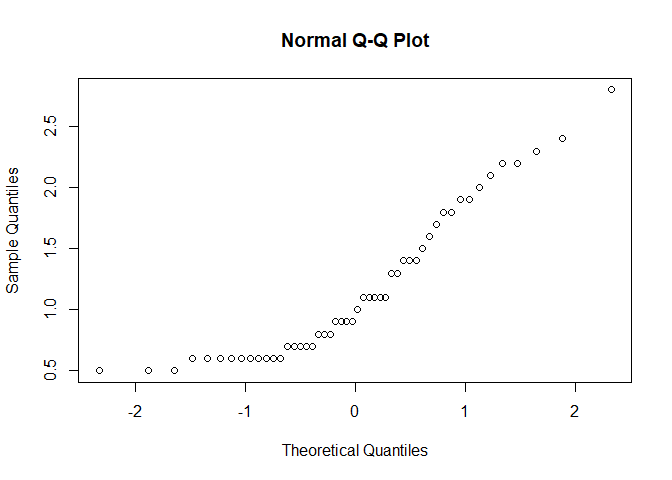
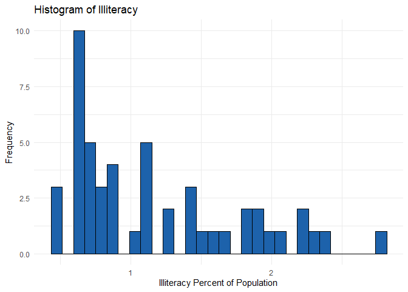
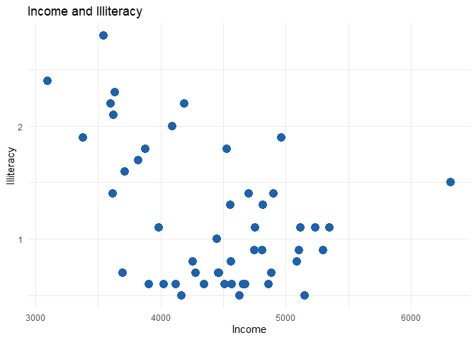

US-States-R-Markdown
================
Katrin Valge
2024-07-07

## Data

Population: population estimate as of July 1, 1975  
Income: per capita income (1974)  
Illiteracy: illiteracy (1970, percent of population)  
Life Exp: life expectancy in years (1969–71)  
Murder: murder and non-negligent manslaughter rate per 100,000
population (1976)  
HS Grad: percent high-school graduates (1970)  
Frost: mean number of days with minimum temperature below freezing
(1931–1960) in capital or large city  
Area: land area in square miles

Source: U.S. Department of Commerce, Bureau of the Census (1977)
Statistical Abstract of the United States. U.S. Department of Commerce,
Bureau of the Census (1977) County and City Data Book.

## Variables and Types

    Population - numeric 
    Income - numeric 
    Illiteracy - numeric 
    Life Exp - numeric 
    Murder - numeric 
    HS Grad - numeric 
    Frost - numeric 
    Area - numeric 

## List of States

    Alabama - Alaska - Arizona - Arkansas - California - Colorado - Connecticut - Delaware - Florida - Georgia - Hawaii - Idaho - Illinois - Indiana - Iowa - Kansas - Kentucky - Louisiana - Maine - Maryland - Massachusetts - Michigan - Minnesota - Mississippi - Missouri - Montana - Nebraska - Nevada - New Hampshire - New Jersey - New Mexico - New York - North Carolina - North Dakota - Ohio - Oklahoma - Oregon - Pennsylvania - Rhode Island - South Carolina - South Dakota - Tennessee - Texas - Utah - Vermont - Virginia - Washington - West Virginia - Wisconsin - Wyoming

## Overview of First Records

               Population Income Illiteracy Life Exp Murder HS Grad Frost   Area
    Alabama          3615   3624        2.1    69.05   15.1    41.3    20  50708
    Alaska            365   6315        1.5    69.31   11.3    66.7   152 566432
    Arizona          2212   4530        1.8    70.55    7.8    58.1    15 113417
    Arkansas         2110   3378        1.9    70.66   10.1    39.9    65  51945
    California      21198   5114        1.1    71.71   10.3    62.6    20 156361
    Colorado         2541   4884        0.7    72.06    6.8    63.9   166 103766

## Summary Data

    Number of rows:  50 
    Number of columns:  8 

       Population        Income       Illiteracy       Life Exp    
     Min.   :  365   Min.   :3098   Min.   :0.500   Min.   :67.96  
     1st Qu.: 1080   1st Qu.:3993   1st Qu.:0.625   1st Qu.:70.12  
     Median : 2838   Median :4519   Median :0.950   Median :70.67  
     Mean   : 4246   Mean   :4436   Mean   :1.170   Mean   :70.88  
     3rd Qu.: 4968   3rd Qu.:4814   3rd Qu.:1.575   3rd Qu.:71.89  
     Max.   :21198   Max.   :6315   Max.   :2.800   Max.   :73.60  
         Murder          HS Grad          Frost             Area       
     Min.   : 1.400   Min.   :37.80   Min.   :  0.00   Min.   :  1049  
     1st Qu.: 4.350   1st Qu.:48.05   1st Qu.: 66.25   1st Qu.: 36985  
     Median : 6.850   Median :53.25   Median :114.50   Median : 54277  
     Mean   : 7.378   Mean   :53.11   Mean   :104.46   Mean   : 70736  
     3rd Qu.:10.675   3rd Qu.:59.15   3rd Qu.:139.75   3rd Qu.: 81163  
     Max.   :15.100   Max.   :67.30   Max.   :188.00   Max.   :566432  

## Normality Tests

### Income

<!-- -->

<!-- -->

        Shapiro-Wilk normality test

    data:  Income
    W = 0.9769, p-value = 0.43

The distribution of the data follows a normal distribution, as the test
statistic W is close to 1 and the p-value is greater than 0.05.

### Illiteracy

<!-- -->

<!-- -->

        Shapiro-Wilk normality test

    data:  Illiteracy
    W = 0.88315, p-value = 0.0001396

Graphics and a low p-value indicates that data isn’t normally
distributed.

## Income and Illiteracy Scatter Plot

<!-- -->

## Spearman Correlation Test

        Spearman's rank correlation rho

    data:  data$Income and data$Illiteracy
    S = 27376, p-value = 0.02608
    alternative hypothesis: true rho is not equal to 0
    sample estimates:
           rho 
    -0.3145948 

The analysis indicates a statistically significant moderate negative
correlation between Income and Illiteracy, higher income tends to be
associated with lower illiteracy rates.
